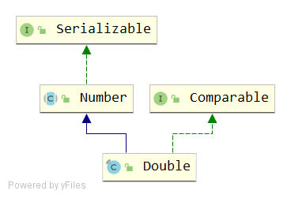

# Double
## signature
```java
public final class Double extends Number implements Comparable<Double>
```


## API
### variables
```java
// 正无穷，等于 Double.longBitsToDouble(0x7ff0000000000000L)
public static final double POSITIVE_INFINITY = 1.0 / 0.0;

// 负无穷，等于Double.longBitsToDouble(0xfff0000000000000L).
public static final double NEGATIVE_INFINITY = -1.0 / 0.0;

// NaN ，等于Double.longBitsToDouble(0x7ff8000000000000L
public static final double NaN = 0.0d / 0.0;

// 最大的正有限值, (2-2^(-52))·2^1023. 等价于 Double.longBitsToDouble(0x7fefffffffffffffL).
public static final double MAX_VALUE = 0x1.fffffffffffffP+1023; // 1.7976931348623157e+308

// 最小正标准值 2^(-1022) 等于 Double.longBitsToDouble(0x0010000000000000L)
public static final double MIN_NORMAL = 0x1.0p-1022; // 2.2250738585072014E-308

// 最小正非零值 等于 Double.longBitsToDouble(0x1L)
public static final double MIN_VALUE = 0x0.0000000000001P-1022; // 4.9e-324

// double类型的最大指数
public static final int MAX_EXPONENT = 1023;

// double类型的最小指数
public static final int MIN_EXPONENT = -1022;

public static final int SIZE = 64;
public static final int BYTES = SIZE / Byte.SIZE; //64/8=8 个字节

public static final Class<Double>   TYPE = (Class<Double>) Class.getPrimitiveClass("double");

private final double value; // Double的值, 是实例变量
```

### constructor
```java
public Double(double value) {
    this.value = value;
}
public Double(String s) throws NumberFormatException {
    value = parseDouble(s);
}
```
入参分别是double类型和String类型。String类型会内部进行解析。
```java
public static double parseDouble(String s) throws NumberFormatException {
    return FloatingDecimal.parseDouble(s);
}
```
这个 FloatingDecimal.parseDouble(s) 里面调用层级很深，先跳过。
