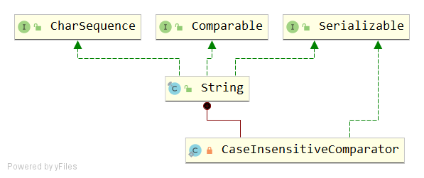

# String
## 类签名
```java
public final class String
    implements java.io.Serializable, Comparable<String>, CharSequence
```


String 类有 final 修饰
## API
### 变量
```java
private final char value[];

/** Cache the hash code for the string */
private int hash; // Default to 0
```
### 构造方法
